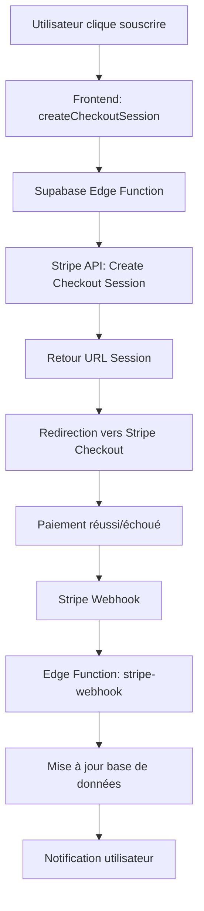
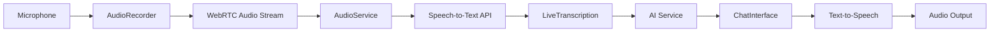

# 📋 Architecture CandiVoc

## 🏗️ Vue d'ensemble

CandiVoc est une **application web de simulation d'entretiens professionnels avec intelligence artificielle** et **chat vocal**. L'architecture suit un modèle ** moderne JAMstack** avec React frontend, Supabase backend, et Stripe pour la monétisation.

### Concept Métier

**Plateforme de simulation d'entretiens d'embauche interactifs avec :**
- Scénarios d'entretiens personnalisés (technique, commercial, présentation, etc.)
- Chat vocal en temps réel avec IA
- Évaluation multi-critères (sémantique, émotionnel, fluidité, pertinence, timing)
- Système d'abonnement avec paliers (Gratuit/Pro/Entreprise)
- Interface moderne et responsive

---

## 🏛️ Architecture Globale

### Stack Technique Principal

```
Frontend (React 19) ──┐
                      ├──► Supabase (Backend-as-a-Service)
Stripe (Paiements) ───┘
```

#### Technologies Utilisées

| Catégorie | Technologie | Version | Utilisation |
|-----------|-------------|---------|-------------|
| **Frontend** | React | 19.1.1 | Framework UI |
| | TypeScript | 5.9.3 | Typage statique |
| | Vite | 7.1.7 | Build tool |
| | Tailwind CSS | 4.1.14 | Styling |
| | React Router | 7.9.4 | Routing |
| | Radix UI | Latest | Headless UI |
| **Backend** | Supabase | Latest | BaaS (Auth, DB, Functions) |
| | PostgreSQL | Latest | Base de données |
| **Paiements** | Stripe | Latest | Abonnements |
| **Autres** | Lucide React | Latest | Icônes |
| | Heroicons | 2.2.0 | Icônes additionnelles |

---

## 🎨 Frontend Architecture (React)

### Structure des Dossiers

```
src/
├── components/              # Composants UI réutilisables
│   ├── chat/               # Interface de chat vocal
│   │   ├── AudioRecorder.tsx
│   │   ├── ChatInterface.tsx
│   │   ├── LiveTranscription.tsx
│   │   ├── VoiceChatInterface.tsx
│   │   └── WaveformVisualizer.tsx
│   ├── pricing/            # Tarification et abonnements
│   │   └── PricingSection.tsx
│   ├── scenarios/          # Cartes de scénarios
│   │   ├── ScenarioCard.tsx
│   │   └── ScenarioList.tsx
│   └── ui/                 # Composants UI de base
│       ├── Button.tsx
│       ├── Input.tsx
│       ├── Modal.tsx
│       ├── Layout.tsx
│       ├── Sidebar.tsx
│       └── Toast.tsx
├── pages/                  # Pages de l'application
│   ├── Landing.tsx         # Page d'accueil
│   ├── Dashboard.tsx       # Tableau de bord
│   ├── Scenarios.tsx       # Liste scénarios
│   ├── Chat.tsx           # Chat vocal
│   ├── Settings.tsx        # Paramètres
│   ├── Pricing.tsx         # Tarifs
│   └── PaymentSuccess.tsx  # Confirmation paiement
├── services/               # Services métier et API
│   ├── auth/              # Authentification
│   ├── supabase/          # Client Supabase
│   ├── ai/                # Service IA
│   ├── audio/             # Audio/vocal
│   └── stripe.ts          # Paiements
├── hooks/                  # Hooks personnalisés
│   ├── useAuth.ts         # Hook authentification
│   ├── useSubscription.ts # Hook abonnements
│   └── useToast.ts        # Hook notifications
├── contexts/               # Contextes React
│   └── ToastProvider.tsx  # Contexte notifications
├── utils/                  # Utilitaires
├── types/                  # Types TypeScript
└── lib/                    # Bibliothèques partagées
```

### Architecture en Composants

#### Pattern Design
- **Architecture :** Atomic Design (Components → Pages)
- **Gestion d'état :** React Context + Hooks personnalisés
- **Authentification :** Context Auth + Protected Routes
- **UI :** Headless UI (Radix) + Tailwind CSS

#### Routes et Navigation

```typescript
// Routes publiques
/                           # Landing page
/config-error              # Erreur configuration
/test-supabase            # Test connexion Supabase

// Routes protégées (PrivateRoute)
/dashboard                 # Tableau de bord utilisateur
/scenarios                 # Gestion scénarios
/sessions                  # Historique sessions
/settings                  # Paramètres utilisateur
/tarifs                    # Tarifs et abonnements
/chat/:sessionId          # Session de chat
/session/:sessionId       # Détails session
/success                  # Confirmation paiement Stripe
```

### Composants Clés

#### Authentification
- **AuthProvider** : Context d'authentification Supabase
- **useAuth** : Hook personnalisé pour l'état auth
- **PrivateRoute** : Wrapper pour routes protégées
- **ConfigChecker** : Validation configuration Supabase

#### Chat Vocal
- **AudioRecorder** : Enregistrement audio WebRTC
- **LiveTranscription** : Transcription temps réel
- **VoiceChatInterface** : Interface complète chat
- **WaveformVisualizer** : Visualisation audio

#### Tarification
- **PricingSection** : Section tarifs avec cards
- **PricingCard** : Carte individuelle tarif
- **SubscriptionStatus** : Statut abonnement utilisateur

---

## 🗄️ Backend Architecture (Supabase)

### Base de Données PostgreSQL

#### Schéma Principal

```sql
-- Table profiles (utilisateurs)
CREATE TABLE profiles (
    id UUID PRIMARY KEY REFERENCES auth.users(id),
    email TEXT NOT NULL,
    first_name TEXT NOT NULL,
    last_name TEXT NOT NULL,
    role TEXT CHECK (role IN ('candidate', 'recruiter', 'admin')) DEFAULT 'candidate',
    subscription_status TEXT DEFAULT 'free', -- free/pro/entreprise
    stripe_customer_id TEXT,
    subscription_id TEXT,
    cancel_at_period_end BOOLEAN DEFAULT FALSE,
    avatar_url TEXT,
    created_at TIMESTAMPTZ DEFAULT NOW(),
    updated_at TIMESTAMPTZ DEFAULT NOW()
);

-- Table scenarios
CREATE TABLE scenarios (
    id UUID PRIMARY KEY DEFAULT gen_random_uuid(),
    title TEXT NOT NULL,
    description TEXT NOT NULL,
    category scenario_category NOT NULL,
    difficulty scenario_difficulty NOT NULL,
    duration INTEGER NOT NULL,
    language TEXT NOT NULL DEFAULT 'fr',
    instructions TEXT NOT NULL,
    ai_personality TEXT NOT NULL,
    created_by UUID REFERENCES profiles(id),
    is_public BOOLEAN DEFAULT TRUE,
    is_active BOOLEAN DEFAULT TRUE,
    created_at TIMESTAMPTZ DEFAULT NOW(),
    updated_at TIMESTAMPTZ DEFAULT NOW()
);

-- Table evaluation_criteria
CREATE TABLE evaluation_criteria (
    id UUID PRIMARY KEY DEFAULT gen_random_uuid(),
    scenario_id UUID REFERENCES scenarios(id),
    name TEXT NOT NULL,
    description TEXT NOT NULL,
    weight INTEGER CHECK (weight > 0 AND weight <= 100),
    type criteria_type NOT NULL,
    created_at TIMESTAMPTZ DEFAULT NOW(),
    updated_at TIMESTAMPTZ DEFAULT NOW()
);
```

#### Types Enum

```sql
-- Catégories de scénarios
CREATE TYPE scenario_category AS ENUM (
    'technical',
    'commercial',
    'presentation',
    'problem-solving',
    'communication'
);

-- Niveaux de difficulté
CREATE TYPE scenario_difficulty AS ENUM (
    'beginner',
    'intermediate',
    'advanced'
);

-- Types de critères d'évaluation
CREATE TYPE criteria_type AS ENUM (
    'semantic',      -- Analyse sémantique
    'emotional',     -- Intelligence émotionnelle
    'fluency',       -- Fluidité verbale
    'relevance',     -- Pertinence des réponses
    'timing'         -- Gestion du temps
);
```

### Sécurité : Row Level Security (RLS)

#### Politiques de Sécurité

```sql
-- Profiles: RLS activé
ALTER TABLE profiles ENABLE ROW LEVEL SECURITY;

-- Politiques profiles
CREATE POLICY "Users can view own profile"
ON profiles FOR SELECT USING (auth.uid() = id);

CREATE POLICY "Users can update own profile"
ON profiles FOR UPDATE USING (auth.uid() = id);

-- Scenarios: RLS activé
ALTER TABLE scenarios ENABLE ROW LEVEL SECURITY;

-- Politiques scenarios
CREATE POLICY "Users can view public scenarios"
ON scenarios FOR SELECT USING (is_public = true);

CREATE POLICY "Users can view own scenarios"
ON scenarios FOR SELECT USING (auth.uid() = created_by);

CREATE POLICY "Users can create scenarios"
ON scenarios FOR INSERT WITH CHECK (auth.uid() = created_by);
```

### Edge Functions Supabase

#### Fonctions Déployées

```typescript
// create-checkout-session
// Crée une session de paiement Stripe
POST /functions/v1/create-checkout-session

// stripe-webhook
// Traite les webhooks Stripe (subscription.created, etc.)
POST /functions/v1/stripe-webhook

// cancel-subscription
// Annule l'abonnement utilisateur
POST /functions/v1/cancel-subscription

// update-subscription
// Met à jour le statut abonnement
POST /functions/v1/update-subscription
```

#### Configuration Variables

```bash
# Variables d'environnement Edge Functions
SUPABASE_URL=project_url
SUPABASE_SERVICE_ROLE_KEY=service_role_key
STRIPE_SECRET_KEY=sk_live_xxx (ou sk_test_xxx)
STRIPE_WEBHOOK_SECRET=whsec_xxx
```

---

## 💳 Architecture Paiements (Stripe)

### Flux d'Abonnement Complet



### Plans Tarifaires

| Plan | Prix | Features | Stripe Price ID |
|------|------|----------|-----------------|
| **Essai Gratuit** | €0 | 5 sessions gratuites | `price_free` |
| **Professionnel** | €19.99/mois | Sessions illimitées | `price_pro_monthly` |
| **Enterprise** | €49.99/mois | Features avancées | `price_enterprise_monthly` |

### Intégration Technique

#### Frontend (React Hook)

```typescript
// hooks/useSubscription.ts
export function useSubscription() {
  const [subscription, setSubscription] = useState<Subscription | null>(null);

  // Récupération depuis profiles.subscription_status
  // Valeurs: 'free' | 'pro' | 'entreprise'
}
```

#### Service Stripe

```typescript
// services/stripe.ts
export interface StripePrice {
  id: string;
  name: string;
  price: number;
  currency: string;
  interval: 'month' | 'year';
  features: string[];
}

class StripeService {
  async createCheckoutSession(params: CheckoutSessionParams) {
    // Appel Edge Function Supabase
  }
}
```

#### Edge Function (TypeScript)

```typescript
// supabase/functions/create-checkout-session/index.ts
const stripe = new Stripe(Deno.env.get('STRIPE_SECRET_KEY'), {
  apiVersion: '2023-10-16'
});

const session = await stripe.checkout.sessions.create({
  customer: stripeCustomerId,
  payment_method_types: ['card'],
  line_items: [{ price: priceId, quantity: 1 }],
  mode: 'subscription',
  success_url,
  cancel_url
});
```

---

## 🔐 Architecture Sécurité

### Authentification

#### Configuration Supabase Auth
- **Provider** : Supabase Auth (GoTrue)
- **Méthodes supportées** :
  - Email/Password
  - OAuth (Google, GitHub)
  - Magic Links
- **Session Management** :
  - JWT tokens avec expiration 1h
  - Refresh tokens automatiques
  - Persist session localStorage

#### Flux Authentification

```typescript
// Context Auth Provider
const AuthProvider = ({ children }) => {
  const [user, setUser] = useState(null);
  const [loading, setLoading] = useState(true);

  // Écoute changements auth
  useEffect(() => {
    supabase.auth.onAuthStateChange((event, session) => {
      setUser(session?.user || null);
      setLoading(false);
    });
  }, []);
};
```

### Protection des Routes

```typescript
// PrivateRoute Component
const PrivateRoute: React.FC = ({ children }) => {
  const { isAuthenticated, loading } = useAuth();

  if (loading) return <LoadingSpinner />;
  if (!isAuthenticated) return <Navigate to="/" replace />;

  return <Layout>{children}</Layout>;
};
```

### Sécurité des Données

#### Variables Environnementales

```bash
# .env.local (non versionné)
VITE_SUPABASE_URL=project_url
VITE_SUPABASE_ANON_KEY=anon_key
VITE_STRIPE_PUBLISHABLE_KEY=pk_live_xxx

# Edge Functions (server-side uniquement)
SUPABASE_SERVICE_ROLE_KEY=service_role_key
STRIPE_SECRET_KEY=sk_live_xxx
```

#### Bonnes Pratiques
- **RLS activé** sur toutes les tables
- **Clés secrètes** uniquement dans Edge Functions
- **HTTPS forcé** sur toute l'application
- **Validation inputs** côté client et serveur
- **Sanitization données** avant insertion DB

---

## 🎯 Architecture Features Spécifiques

### Chat Vocal avec IA

#### Pipeline Audio



#### Composants Techniques

```typescript
// AudioRecorder.tsx
class AudioRecorder {
  private mediaRecorder: MediaRecorder | null = null;
  private audioChunks: Blob[] = [];

  async startRecording(): Promise<void> {
    const stream = await navigator.mediaDevices.getUserMedia({ audio: true });
    this.mediaRecorder = new MediaRecorder(stream);
    // ...
  }
}

// LiveTranscription.tsx
const LiveTranscription = ({ audioBlob, onTranscript }) => {
  const [transcript, setTranscript] = useState('');

  useEffect(() => {
    if (audioBlob) {
      // Appel API Speech-to-Text
      speechToText(audioBlob).then(setTranscript);
    }
  }, [audioBlob]);
};
```

### Système de Scénarios

#### Catégories et Difficultés

```typescript
export interface Scenario {
  id: string;
  title: string;
  description: string;
  category: 'technical' | 'commercial' | 'presentation' | 'problem-solving' | 'communication';
  difficulty: 'beginner' | 'intermediate' | 'advanced';
  duration: number; // minutes
  language: string;
  instructions: string;
  ai_personality: string;
  evaluation_criteria: EvaluationCriteria[];
}

export interface EvaluationCriteria {
  id: string;
  name: string;
  description: string;
  weight: number; // 1-100
  type: 'semantic' | 'emotional' | 'fluency' | 'relevance' | 'timing';
}
```

#### Personnalités IA

```typescript
const AI_PERSONALITIES = {
  technical: {
    tone: 'analytical',
    focus: 'problem-solving',
    questions: 'algorithmic',
    evaluation: 'technical accuracy'
  },
  commercial: {
    tone: 'persuasive',
    focus: 'sales skills',
    questions: 'objection handling',
    evaluation: 'persuasion effectiveness'
  },
  // ...
};
```

---

## 📊 Architecture État et Gestion des Données

### État Global (Contextes)

```typescript
// Auth Context
interface AuthContextType {
  user: User | null;
  loading: boolean;
  signIn: (email: string, password: string) => Promise<void>;
  signUp: (email: string, password: string) => Promise<void>;
  signOut: () => Promise<void>;
}

// Toast Context
interface ToastContextType {
  toasts: Toast[];
  addToast: (toast: Omit<Toast, 'id'>) => void;
  removeToast: (id: string) => void;
}
```

### Services de Données

#### Client Supabase (Singleton)

```typescript
// services/supabase/client.ts
const supabaseUrl = import.meta.env.VITE_SUPABASE_URL;
const supabaseAnonKey = import.meta.env.VITE_SUPABASE_ANON_KEY;

export const supabase = createClient(supabaseUrl, supabaseAnonKey, {
  auth: {
    autoRefreshToken: true,
    persistSession: true,
    detectSessionInUrl: true
  }
});
```

#### Services Métier

```typescript
// services/supabase/scenarios.ts
export const ScenariosService = {
  async getScenarios(category?: string) {
    let query = supabase.from('scenarios').select('*');
    if (category) query = query.eq('category', category);
    return await query;
  },

  async createScenario(scenario: Partial<Scenario>) {
    return await supabase.from('scenarios').insert(scenario);
  }
};
```

---

## 🚀 Architecture Déploiement et Performance

### Frontend (Build & Hosting)

#### Configuration Vite

```typescript
// vite.config.ts
export default defineConfig({
  plugins: [react()],
  build: {
    outDir: 'dist',
    sourcemap: true,
    rollupOptions: {
      output: {
        manualChunks: {
          vendor: ['react', 'react-dom'],
          ui: ['@radix-ui/react-dialog', '@radix-ui/react-toast']
        }
      }
    }
  },
  optimizeDeps: {
    include: ['react', 'react-dom']
  }
});
```

#### Optimisation Performance
- **Code Splitting** : Routage React + lazy loading
- **Bundle Size** : Tree-shaking + minification Vite
- **CDN** : Distribution globale automatique
- **Caching** : Headers cache statiques

### Backend (Supabase)

#### Architecture Serverless
- **Auto-scaling** : Supabase gère automatiquement
- **Global CDN** : Edge Functions worldwide
- **Database** : PostgreSQL managé avec backups
- **Monitoring** : Dashboard Supabase intégré

---

## 🔮 Architecture Évolutive

### Points d'Extension

#### Nouvelles Features

```typescript
// Support multi-langues
interface LocalizedScenario extends Scenario {
  language: 'fr' | 'en' | 'es' | 'de';
  localized_content: Record<string, string>;
}

// Analytics avancés
interface AnalyticsEvent {
  user_id: string;
  event_type: string;
  session_id?: string;
  metadata: Record<string, any>;
  timestamp: string;
}

// API REST pour partenaires
export const PartnerAPI = {
  async getScenarios(apiKey: string) { /* ... */ },
  async submitEvaluation(apiKey: string, data: any) { /* ... */ }
};
```

#### Scalabilité Technique

| Composant | Solution Scalabilité | Implementation |
|-----------|---------------------|----------------|
| **Frontend** | Static hosting | Vercel/Netlify infini |
| **Backend** | Serverless auto-scale | Supabase Edge Functions |
| **Database** | PostgreSQL scaling | Supabase managed |
| **Storage** | Files storage | Supabase Storage |

### Monitoring et Observabilité

#### Logs et Errors
- **Frontend** : Error boundary + console logging
- **Backend** : Supabase logs + Edge Functions logs
- **Performance** : Web Vitals monitoring

#### Recommandations Futures

1. **React Query** : Cache et gestion état serveur
2. **Tests** : Jest + Testing Library + Cypress
3. **CI/CD** : GitHub Actions + auto-deploy
4. **Analytics** : Plausible/Hotjar
5. **Error Tracking** : Sentry
6. **Documentation** : Storybook + API docs

---

## 🎯 Résumé Architecture

### Forces ✅

- **Stack moderne 2024** : React 19 + TypeScript + Supabase
- **Backend serverless** : Infrastructure gérée et scalable
- **Sécurité intégrée** : RLS + Auth Supabase
- **Monétisation complète** : Stripe abonnements
- **Performance optimisée** : Vite + static hosting
- **Type-safe** : TypeScript end-to-end
- **Responsive design** : Mobile-first

### Axes d'Amélioration 🔄

- **State management** : Ajouter React Query
- **Testing** : Suite de tests complète
- **Monitoring** : Analytics et error tracking
- **CI/CD** : Pipeline de déploiement
- **Documentation** : API docs et guides utilisateurs

Cette architecture est **optimale pour un MVP SaaS moderne** avec excellent équilibre entre **rapidité de développement**, **scalabilité** et **maintenance**.

---

*Document généré le 26/10/2025 - Architecture CandiVoc v1.0*